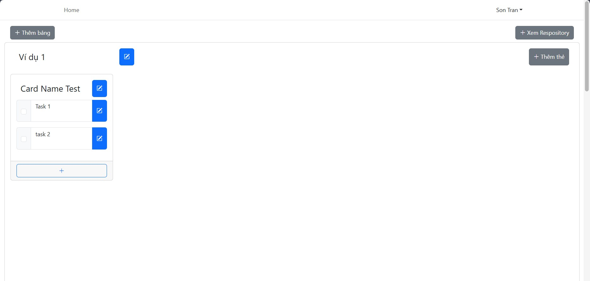
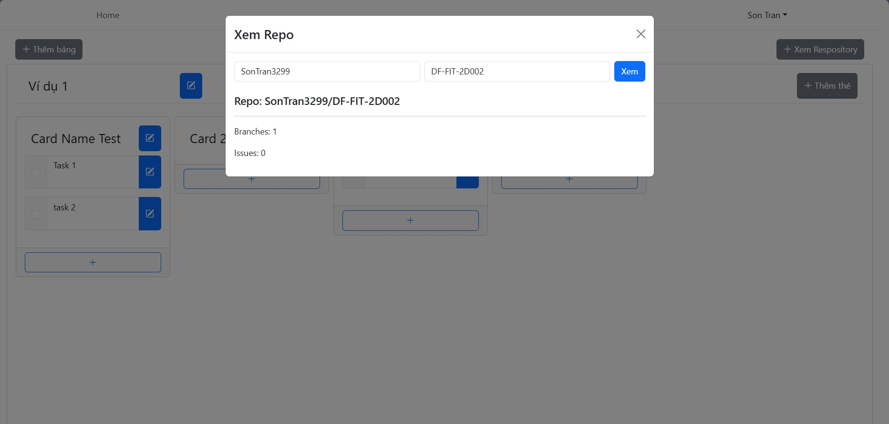
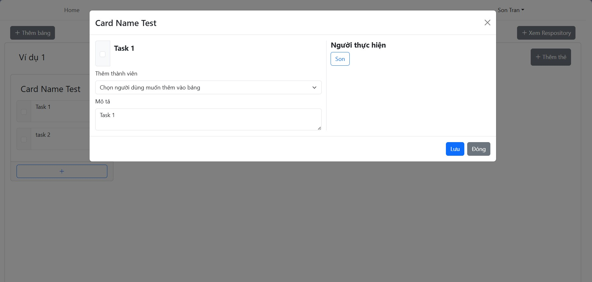

# Board Management App

Use Reactjs in combination with Firebase Realtime Database and Expressjs to create a to-do management website.

## Installation

Navigate to the client folder:
```sh
cd client
```

Initialize a new frontend web project.

```bash
npm create vite@latest
```

Create new frontend project
```sh
npm create vite@latest
```

Install Frontend dependencies:
```sh
npm install
```
Start the Development Server
```sh
npm run dev
```
Navigate to the server folder:
```sh
cd server
```
Install Expressjs dependencies:
```sh
npm install
```
Running a server with Nodemon:
```sh
npm run dev
```

# Directory Structure:
```text
board-management-app/
├── client/                
│   ├── public/            
│   └── src/              
│       ├── assets/       
│       ├── Components/    
│       ├── Dashboard/
│       ├── Hooks/      
│       └── Pages/     
│           ├── Authentication
│           ├── Layout/  
│           └── User/    
├── screenshots/       
└── server/

Key Features:
- Create, Add, Edit, Delete boards, cards, task
- Assign or Remove a member to a task
- 

Techstack:
- Front-end: Reactjs
- Backend: Expressjs
- Database: Firebase Realtime Database
- UI Framwork: React Bootstrap

### Screenshots
- Dashboard 


- Fetch relevant information from GitHub Repository 


- Task Information 
